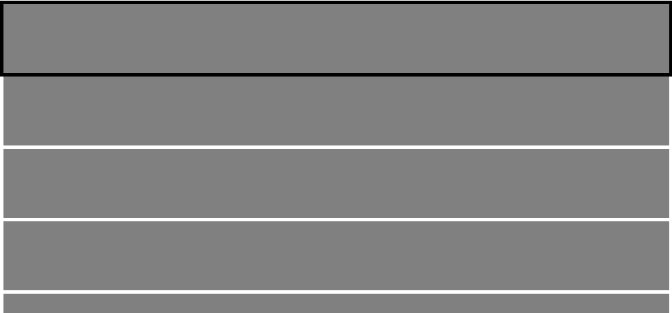

# spatial-navigation-cursor

A simple spatial navigation cursor library



You can see how it works [here](https://ygoto3.github.io/spatial-navigation-cursor/demo/).

## Install

```sh
$ npm i spatial-navigation-cursor
```

## Usage

Give an element "focused" class name.  (You can use any other class name if you want.)

```html
<main>
  <div class="block focused"></div>
  <div class="block"></div>
  <div class="block"></div>
  <div class="block"></div>
  <div class="block"></div>
</main>
```

`.__spatial-navigation-cursor__` is a class selector for the cursor.  Write css code for the selector.

```css
:root {
  --transition-duration: .2s;
  --transition-easing: ease-out;
}

.__spatial-navigation-cursor__ {
  outline: 5px solid black;
  transition: width var(--transition-duration) var(--transition-easing), height var(--transition-duration) var(--transition-easing), transform var(--transition-duration) var(--transition-easing);
}
```

Instantiate a new cursor manager and start it.  When you give an element the focus class name, the cursor manager automatically moves the cursor to the element.

```js
import CursorManager from 'spatial-navigation-cursor';

const cursorManager = new CursorManager({
  root: document.body,
  focusClassName: 'focused',
});

cursorManager.start();

window.addEventListener('keydown', (e) => {
  e.preventDefault();
  switch (e.key) {
    case 'ArrowUp':
    case 'ArrowDown': {
      const focused = document.querySelector('.focused');
      if (e.key === 'ArrowUp') {
        const prev = focused.previousElementSibling;
        if (!prev) return;
        prev.classList.add('focused');
        focused.classList.remove('focused');
      } else {
        const next = focused.nextElementSibling;
        if (!next) return;
        next.classList.add('focused');
        focused.classList.remove('focused');
      }
      break;
    }
  }
});
```

## Advanced Usage

### Cursor Style Modifier

You can modify the cursor's style by add a custom data attribute to a focusable element.

```html
<main>
  <div class="block focused" data-snc-modifer="green"></div>
  <div class="block" data-snc-modifer="green"></div>
</main>
```

The custom data attribute is copied to the cursor element, so you can extend the style like below.

```css
[data-snc-modifer="green"].__spatial-navigation-cursor__ {
  outline-color: green;
}
```

### Untracking

By default, when the cursor moves to a focused element, the cursor manager automatically scroll the window to track the element.  Sometimes you do not want the manager to scroll the window for a specific element.  For example, you do not want window scrolling for a position-fixed element.

You can disable tracking motion by setting `"false"` to an element's `data-snc-tracked` attribute.

```html
<main style="position: fixed">
  <div class="block focused" data-snc-tracked="false"></div>
  <div class="block" data-snc-tracked="false"></div>
</main>
```

## API document

API document is [here](https://ygoto3.github.io/spatial-navigation-cursor/class/spatial-navigation-cursor/index.js~CursorManager.html).
